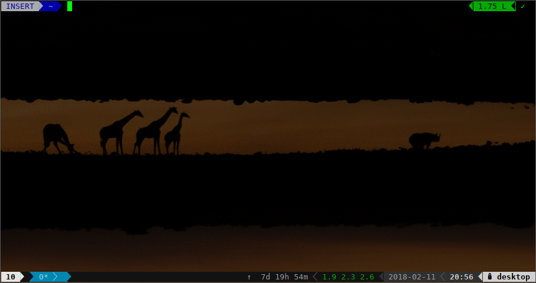

# ddsd

Safely flash SD card images with progress indication



Similar to the `dd` command, but performs several safety checks, implements a simple syntax, and features a progress bar.

## Usage

```
ddsd (-b/--block-size <block size>) <img_file> <block_device>
```

More at [ownyourbits](https://ownyourbits.com/2018/02/11/safely-flash-sd-card-images-with-ddsh/)
